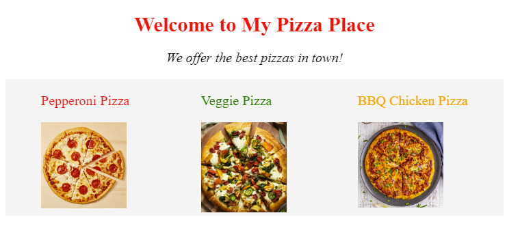

# Javascript DOM Practice

Take a look at this **pizza website**. The alignment of the text and pizzas are off, so let's fix it. We could fix it directly in html and css, but let's practice using Javascript instead! Let's also add a few new things!

### Tasks:

1. Change the **text-align*** property of the header and description to "center".

* ``` When using dot notation in javascript, properties with dashes (-) in them do not work. header.style.text-align won't work, so instead, properties with multiple words use Camel Case instead (textAlign) ```

2. Change the **justify-content** property of the pizza-list divider to "space-around"

3. Change the src of the second pizza's image to "images/veggie.png". 

4. Change the text color of Pepperoni Pizza to red.

5. Change the text color of BBQ Chicken Pizza to orange.


